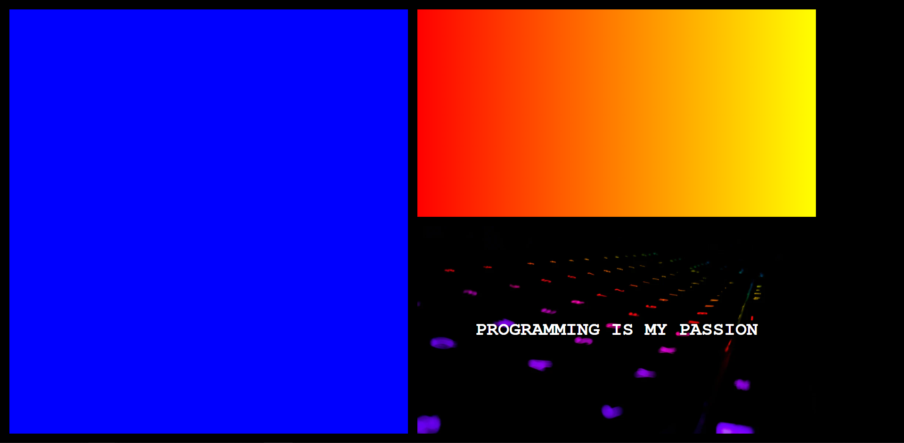

# Modelo Grid

Projeto que resolve o desafio nº 12 do teste de desenvolvimento de sistemas - frontend da Code7.

## Desafio

Desafio consiste em reproduzir o layout proposto na imagem a seguir utilizando CSS Grid e então aplicar o estilo descrito também a seguir:

### Requisitos

 - Item 1: Background na cor azul. 
 - Item 2: Background em gradiente da esquerda para direita (duas cores distintas).
 - Item 3: Background com uma imagem e texto sobre a imagem.

## Resultado

O resultado do projeto pode ser visto na imagem a seguir:

